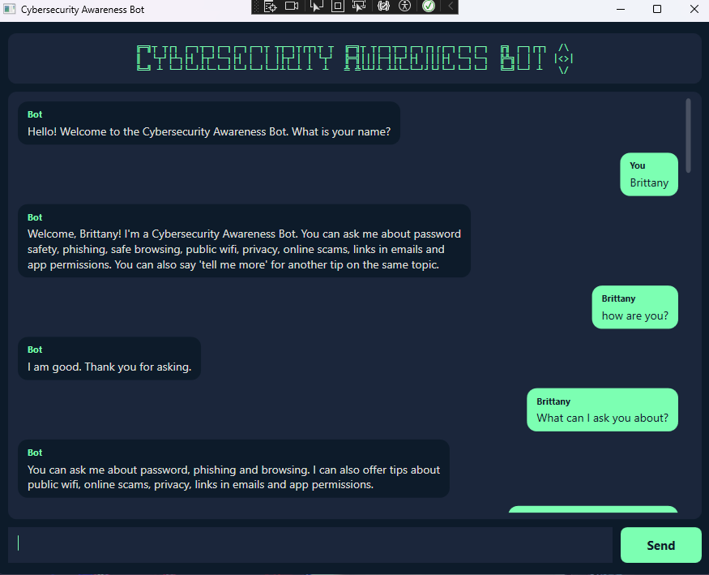
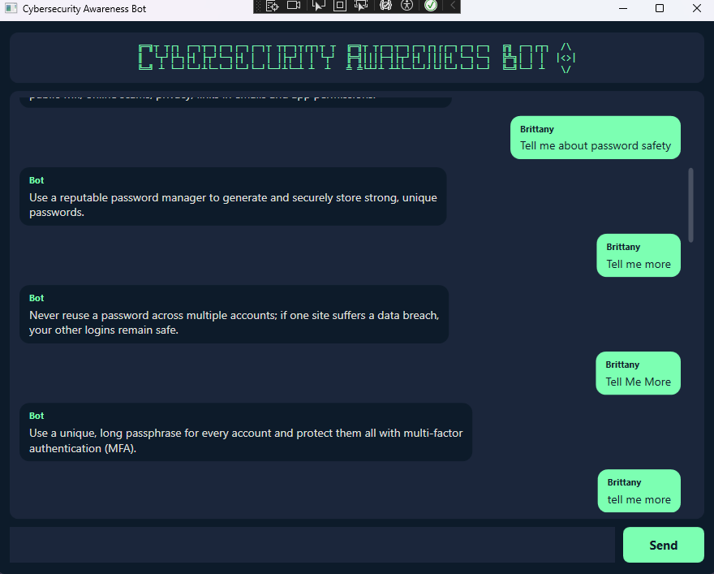
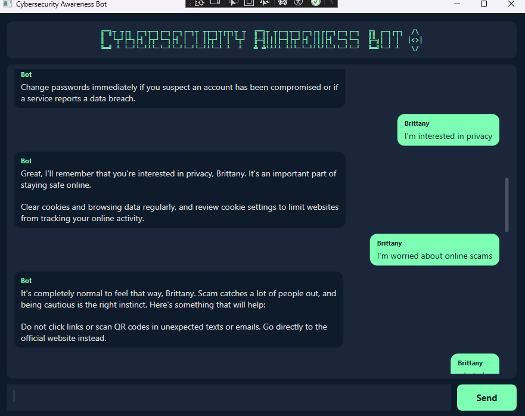
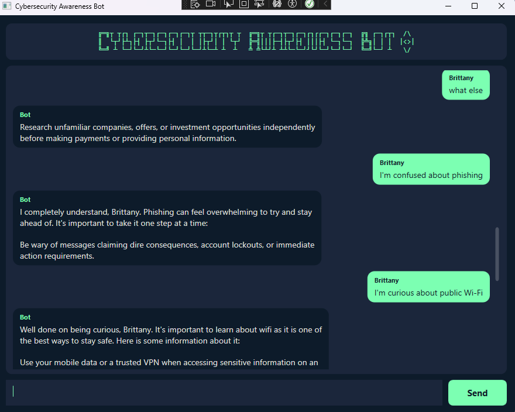
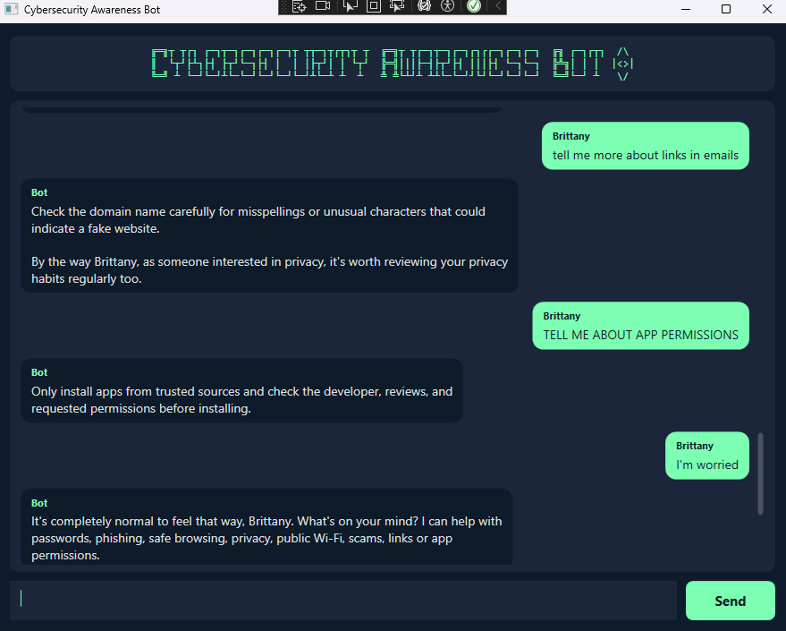
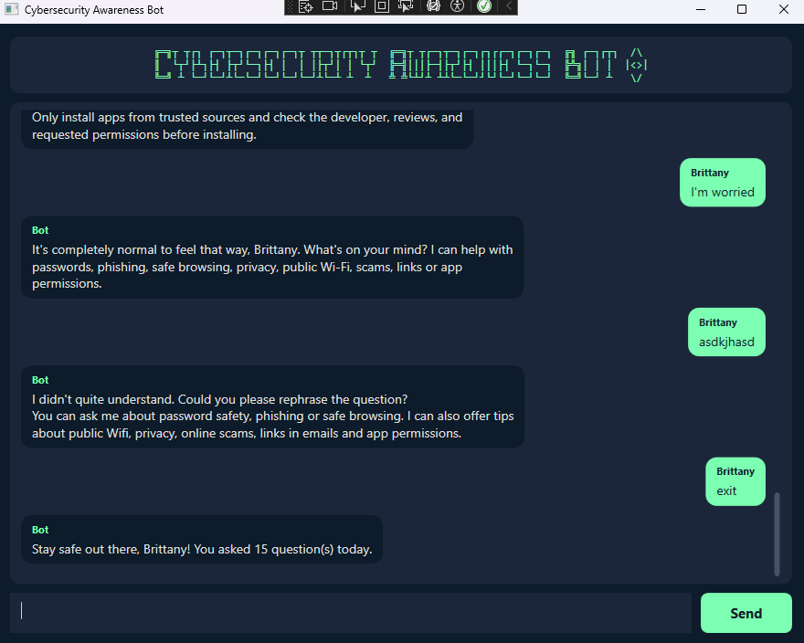
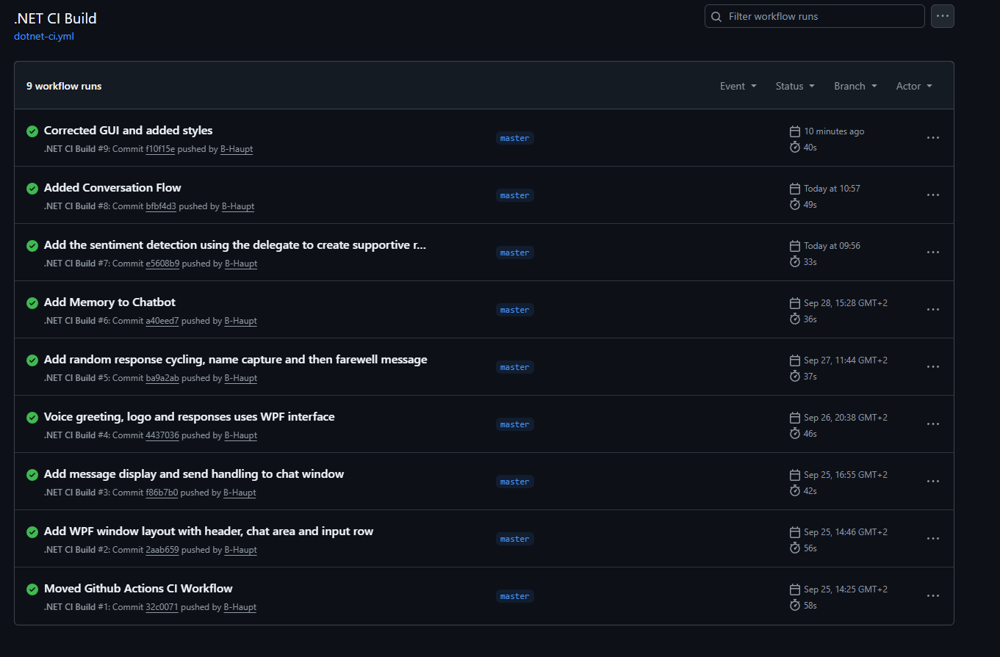

# Cybersecurity Awareness Bot - Part 2

This is a C# WPF application built for my POE assignment for Programming 2A. It is a chatbot that shares safety tips with users about how to stay safe online.

Part 2 takes the console application from Part 1 and rebuilds it as a Windows desktop application with a graphical user interface. The chatbot has now being upgraded to recognises cybersecurity keywords, gives a different tip each time you ask, remembers what you are interested in, detects how you are feeling, and can continue a topic when you ask follow-up questions.

- **Name:** Brittany Haupt
- **Student number:** ST10500773
- **Module:** PROG6221 Programming 2A

## Project Structure
```
CybersecurityAwarenessBot.Part2/
|
|-- CybersecurityAwarenessBot.Part2.sln
|-- .github/workflows/
|   `-- dotnet-ci.yml                 # GitHub Actions CI build workflow
|
`-- CybersecurityAwarenessBot.Part2/
    |-- App.xaml                      # Colour palette, button and scrollbar styles
    |-- MainWindow.xaml               # Window layout
    |-- MainWindow.xaml.cs            # Displays messages and passes input to the bot
    |
    |-- Bot/
    |   |-- ChatBot.cs                # Decides how the chatbot replies
    |   |-- BotResponses.cs           # Keyword to tip lookup with random selection
    |   |-- SentimentAnalyser.cs      # Detects emotion using a delegate
    |   |-- InputValidator.cs         # Validates and normalises user input
    |   |-- UserProfile.cs            # Stores the user's name and interests
    |   |-- LogoArt.cs                # Supplies the ASCII art logo
    |   `-- GreetingPlayer.cs         # Plays the WAV voice greeting
    |
    `-- Media/
        `-- Bot.wav                   # Recorded voice greeting
```


## Features of Project (Part 2)

- **Graphical interface** : This is a WPF window with an ACSII art header, which has a title of the program with a shield next to it. There is also a scrollable chat area and it has an input box for the user to type it input.
- *Voice greeting**: The program starts with the WAV file running, which greets the user. It uses `System.Media.SoundPlayer` to play the voice greeting.
- **ASCII art title**: The title is displayed and showing in colour with a shield next to it. The art title is only displayed after the voice greeting has run.
- **Asks the user for their name**: The program starts and asks the user for their name and then calls them that through the conversation with the user.
- **Keyword response system**: The bot answers questions on passwords, phishing, safe browsing, public wifi, online scams, links in emails and app permissions. You can also ask it how it is and what it's purpose is.
- **Input validation**: The program deals with the user entering whitespace or nothing at all, without the whole program crashing.
- **Formatted console interface**: the interface is easy to read because of the colours, section headers and dividers, and the slow typing response from the chatbot makes it feel like you are really talking to a computer.
- **Modular structure**: the logic is split into multiple classes to handle everything without overloading all the code into `Program.cs`.

## Requirements

- Can only be run on Windows, because `System.Media.SoundPlayer` only works on Windows.
- Visual Studio 2022 with the .NET desktop development workload, or the .NET 8 SDK.

## How to Run

1. Clone the repository.
2. Open `CybersecurityAwarenessBot.Part2.sln` in Visual Studio 2022.
3. Press Ctrl+F5 to build and run the project.

## Topics

The program covers the following topics:
1. Password safety
2. Phishing
3. Safe browsing
4. Public wifi
5. Privacy
6. Online scams
7. Links in emails
8. App permissions

General Questions Covered
1. "How are you?"
2. "What is your purpose?"
3. "What can I ask you about?"


## Example of a conversation with the chatbot:













## Continuous Integration

The workflow is set up in GitHub so that every push triggers it. The workflow checks out the code, installs the .NET 8 SDK, restores dependencies and builds the solution in Release configuration.



## Releases

| Version | What it added |
| v2.0    | WPF project set up, Part 1 classes ported, window layout built |
| v2.1    | Random response cycling, name capture, farewell message |
| v2.2    | Memory, sentiment detection, conversation flow and GUI polish |


## Video Presentation

YouTube link: 

